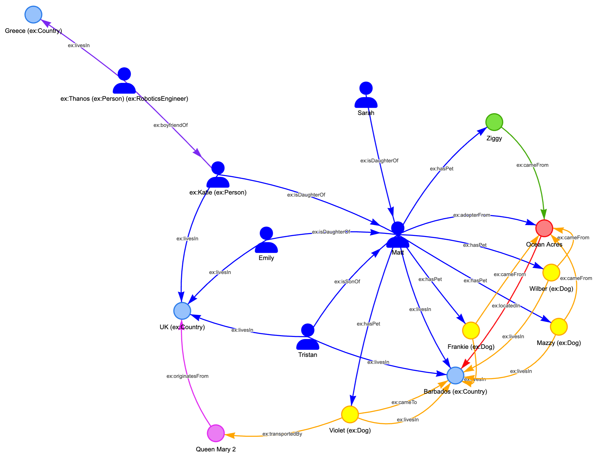
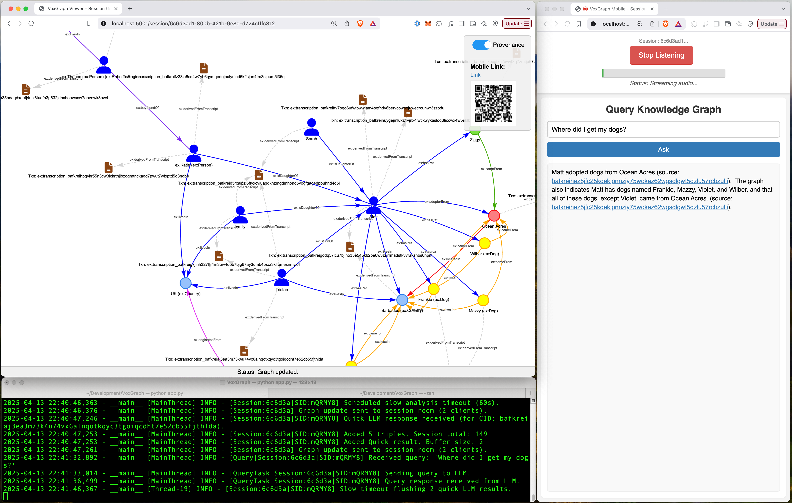

# VoxGraph: Real-time Audio to Knowledge Graph with Verifiable Data Provenance



Author: Matt Hamilton - matt@dharach.com

VoxGraph is a real-time system designed to capture spoken conversations, transform them into structured knowledge graphs, and crucially, ensure the **verifiability and provenance** of the generated data. It directly addresses the challenges of building trustworthy AI systems by linking generated knowledge graph triples back to their source audio transcriptions using **IPFS Content Identifiers (CIDs)**. By optionally archiving the source transcriptions on **decentralized storage (Filecoin via Lighthouse.storage)**, VoxGraph provides a practical tool for creating transparent and auditable knowledge bases from real-world interactions.

This project aligns strongly with the **"Verifiability"** theme of the **"Hack the Data Layer for AI"** challenge, offering a system for recording the provenance of AI-generated structured data derived from primary sources.

## Features

*   **Session Isolation:** Each use creates a unique, isolated session with its own knowledge graph and LLM context, preventing data mixing.
*   **Real-time Audio Transcription:** Captures microphone input via Web Audio API and transcribes it using the low-latency Google Gemini Live API.
*   **AI-Powered Knowledge Extraction:** Leverages LLMs (e.g., Gemini models) to automatically extract entities and relationships from transcriptions, structuring them as RDF triples (Turtle syntax).
*   **Verifiable Data Provenance:**
    *   Generates a unique IPFS CID for each source transcription.
    *   Embeds this source CID within the RDF graph, linking extracted facts back to the specific text they were derived from.
    *   Optionally archives the source transcription CAR file immutably on Filecoin via Lighthouse.storage, making the source data independently retrievable and verifiable using the CID.
*   **Real-time Graph Visualization:** A dedicated web interface (`/session/<session_id>`) uses Vis.js to display the evolving knowledge graph for each session.
*   **Natural Language Querying (Session-Specific):** Allows users to ask questions about the session's generated knowledge graph using natural language, with answers provided by a query-focused LLM.

## How it Addresses the Hackathon Challenge

VoxGraph directly tackles the **"Verifiable & Reproducible AI"** challenge statement by providing a **"System for recording the complete provenance of an AI model [output]"**.

1.  **Data Source Linking:** Every piece of structured data (RDF triple) generated by the "quick" LLM is associated with a parent transcription node.
2.  **Content Addressing:** This transcription node contains the IPFS CID of the source text document.
3.  **Decentralized Archiving:** Optionally, the source text itself (as a CAR file) is uploaded to Filecoin via Lighthouse, pinned using its CID.
4.  **Auditability:** This creates a transparent chain: An assertion in the knowledge graph can be traced back to its specific transcription node, whose CID allows retrieval and verification of the exact source text from decentralized storage. This ensures the generated knowledge is grounded and auditable.



## Architecture Overview

1.  **User Interaction:** Users start a session via the main URL, which redirects them to a unique session viewer (`/session/<id>`). This viewer provides a link/QR code to a corresponding mobile input client (`/mobile/<id>`).
2.  **Audio Capture:** The mobile client captures audio and streams it via SocketIO to the server.
3.  **Server Processing (Flask/SocketIO):**
    *   Manages distinct sessions, isolating data (graphs, LLM contexts) for each.
    *   Receives audio, sends it to Google Live API for transcription.
    *   Processes transcriptions:
        *   Generates CID for the text.
        *   Optionally uploads CAR file to Lighthouse/Filecoin.
        *   Uses a "Quick" LLM (e.g., Gemini Flash) to extract RDF triples, embedding the source CID.
        *   Adds triples to the session's RDFLib graph.
        *   Optionally uses a "Slow" LLM (e.g., Gemini Pro) for background analysis/refinement of the session graph.
    *   Handles graph queries using a dedicated LLM and the session's graph context.
4.  **Real-time Updates:** Sends graph changes via SocketIO to the specific session's viewer.
5.  **Visualization:** The session viewer uses Vis.js to render the knowledge graph.


## Usage

**1. Public Instance (Recommended for Quick Testing):**

*   A publicly deployed instance is available for testing:
*   **Access:** Go to **https://voxgraph.1u7f1mp6xey6.us-south.codeengine.appdomain.cloud/**
*   This will redirect you to a unique session viewer. Use the link/QR code provided *on that page* to open the mobile client for your session in another tab or on your phone.

**2. Running Locally:**

## Prerequisites

*   **Python:** 3.10+
*   **pip:** Python package installer.
*   **Google Cloud Project:** With the Gemini API enabled.
*   **Google API Key:** Authorized to use the Gemini API. **Crucial!**
*   **Modern Web Browser:** Supporting Web Audio API, AudioWorklet, WebSockets, Canvas (Chrome, Firefox, etc.). *(Note: Check for interfering browser extensions like MetaMask or Brave Shields if graph rendering fails)*.
*   **(Optional) Lighthouse API Key:** Required *only* if you want to enable automatic archiving of transcriptions to Filecoin via Lighthouse.storage.
*   **(Optional - for Local Mobile Testing):** `ngrok` ([https://ngrok.com/](https://ngrok.com/)) to create an HTTPS tunnel to your local server.

## Installation (Mac/Linux)

1.  **Clone the Repository:**
    ```bash
    git clone https://github.com/hammertoe/VoxGraph # Or your repo URL
    cd VoxGraph
    ```

2.  **Create and Activate Virtual Environment:**
    ```bash
    python3 -m venv venv
    source venv/bin/activate
    ```

3.  **Install Dependencies:**
    ```bash
    pip install -r requirements.txt
    ```

4.  **Download NLTK Data (if needed):** The script attempts automatic download on first run. Or run manually:
    ```bash
    python -m nltk.downloader punkt
    ```

## Configuration

1.  **API Keys:** Create a `.env` file in the project root:
    ```dotenv
    # Required: Your Google API Key
    GOOGLE_API_KEY=YOUR_ACTUAL_GOOGLE_API_KEY_HERE

    # Optional: Your Lighthouse API Key for Filecoin upload
    # Leave blank or omit if not using this feature
    LIGHTHOUSE_API_KEY=YOUR_LIGHTHOUSE_API_KEY_HERE
    ```
    **Important:** Add `.env` to your `.gitignore`.

2.  **(Optional) Model Names:** Override default LLM models via environment variables (in `.env` or system):
    *   `GOOGLE_LIVE_MODEL`
    *   `QUICK_LLM_MODEL`
    *   `SLOW_LLM_MODEL`
    *   `QUERY_LLM_MODEL`

## Running Locally

1.  **Activate Virtual Environment:**
    ```bash
    source venv/bin/activate
    ```
2.  **Run the Server:**
    ```bash
    python app.py
    ```
3.  The server typically starts on `http://0.0.0.0:5001`.

*   **Start Session:** Open `http://localhost:5001/` in your browser. You'll be redirected to your unique session viewer URL (`/session/<session_id>`).
*   **Open Mobile Client:** Use the link or QR code shown in the Session Viewer to open the Mobile Input client (`/mobile/<session_id>`).
*   **Mobile Access (Local Network):** If accessing the mobile client from a different device on your local network (e.g., phone using `http://<your-local-ip>:5001/mobile/...`), microphone access will likely fail (needs HTTPS).
    *   **Solution:** Use `ngrok http 5001` to get an `https://....ngrok-free.app` URL. Open *this* ngrok URL in your browser. It will create a *new* session viewer over HTTPS. Use the link/QR code from *this* HTTPS viewer page to access the mobile client securely.
*   **Using the App:**
    *   Click "Start Listening" on the mobile client. Speak clearly.
    *   Watch the graph build in the session viewer.
    *   Click "Stop Listening".
    *   Ask questions about the session's graph using the query box on the mobile client.

## Troubleshooting

*   **Graph Not Rendering / SES Errors:** Often caused by browser extensions (MetaMask, security tools, Brave Shields). Try disabling extensions or using a different browser/profile.
*   **Microphone Not Working (Mobile/Local):** Ensure you are accessing the mobile client page via HTTPS (using `ngrok` for local testing) or `localhost`.
*   **LLM/API Errors:** Check server logs for API key issues, model name errors, or Google Cloud quota problems.